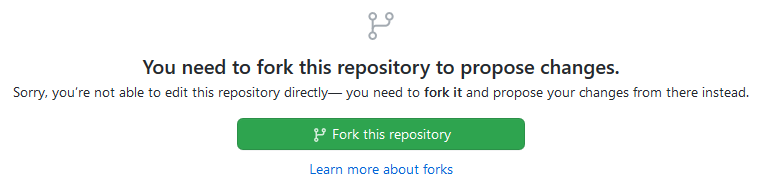

If you notice an inaccuracy, mistake, typo or want to supplement the information in this documentation, then you can help us to improve it.

There are several ways:

1. [Creating an issue](https://github.com/SquareGPS/navixy-api/issues/new) with a detailed description of the problem.
2. [Editing a single page in a browser](#easy-way).
3. [Manually creating a fork](#second-way) and doing multiply commits before creating a pull request.
4. [Installing and editing](#hard-way) documentation locally on yours PC.

In each of these cases, a GitHub account required.
If you don't want to register on GitHub, you can just [contact us](https://developers.navixy.com/general/contacts/) 
with any convenient way.

***

### Easy way

On each page in the upper right corner of the text top there is a link with a picture of a pencil :material-pencil:.
After clicking on this link, you will be asked to create a fork of the repository (if you have
not done this before). 



Creating a fork done with one green button. After that, the edit form with page source code will open.

> For correct edit of page, please read the [introduction into Mkdocs](#introduction-into-mkdocs).

After editing the page, you must fill out a description of what you have done.


Submitting a change will write it to a new branch in your fork, so you can send a pull request. 
We will review your pull request and accept it in the main branch.

Thus, this method is only suitable for simple edits on one page.
There is [another way](#second-way) to create pull requests to fix multiple pages at once.

***

### Second way

This method allows you to make several edits on different pages before proposing them in a pull request.

1. Create a fork [of the repository](https://github.com/SquareGPS/navixy-api) if it has not been created yet.
    (Just click the "Fork" button in the upper right corner.)
2. Go to the created fork and find the file you are interested in.
3. Open the file and click the edit button.
4. Make edits and commit with a clear description of the changes.
5. Edit other files of interest to you in the same way.
6. Go to the start page of the fork and click on the "Pull request" button.

After review and pull request will be merged, and you can drop a fork.

***

### Hard way

This method involves installing the Git, IDE, Python and 
[Material for MkDocs](https://squidfunk.github.io/mkdocs-material) on yours PC.

1. Install [Python 3](https://www.python.org/downloads/).
2. Install [Git client](https://git-scm.com/downloads).
3. Install an IDE, for example [IntelliJ IDEA](https://www.jetbrains.com/idea/) (Community edition would be enough).
4. Create a fork [of the repository](https://github.com/SquareGPS/navixy-api) and cloning it to local project. 
   In IDEA: `File` -> `New` -> `Project from version control`;
5. Install [mkdocs-material](https://squidfunk.github.io/mkdocs-material) and other dependencies. In console:
   ```sh
   cd /path/to/project
   mkdir venv
   python -m venv ./venv
   pip3 install -r requirements.txt
   ```
6. Start the documentation server locally. In console:
   ```sh
   cd /path/to/project
   source venv/bin/activate
   # Windows: \venv\Scripts\activate.bat
   mkdocs serve --dirtyreload
   ```
7. To check that the server has started, open in a browser: http://localhost:8000
8. Create a local git branch in project.
9. Make changes in documentation and test it in browser. 
   Read the [introduction](#introduction-into-mkdocs).
10. Commit and push changes. Please, use English in commit message.
11. Create a Pull Request (PR) on GitHub from your fork. Please, use English in PR description.
12. After the PR has been reviewed and merged to upstream you can remove
    branch and rebase a fork to the upstream.

***

## Introduction into Mkdocs

This documentation built on [mkdocs engine](https://mkdocs.org) and [mkdocs-material theme](https://squidfunk.github.io/mkdocs-material).
Firstly, read [how to structure and write your Markdown source files](https://mkdocs.org/user-guide/writing-your-docs)
for an overview of how to write docs.

***

### Menu

Menu is automatically forming by plugin [awesome-pages](https://github.com/lukasgeiter/mkdocs-awesome-pages-plugin).
To set the desired page order in the menu, use the file `.pages.yml` in directory.
For example:

```yaml
title: Backend API
nav:
  - introduction.md
  - how-to
  - resources
  - websocket
```

`title` sets the name for menu section. 
`nav:` sets the sub-items order.

***

### Meta information

Each page must have meta information section at the beginning. Required fields: `title` and `description`. 
For example:

```yaml
---
title: Get involved
description: Get involved into improving documentation and translations of the Navixy Platform
---
```

Title will be displayed in menu and in browser title.

***

### Headers

The information on each page should be structured. On pages of the same type, 
the structure should be uniform.

***

### Example

API resource page structure:

```markdown
# Resource name

Resource description.

## Object name

Object and its description

## API actions

Path: `/path/to/resource/`.

### method1

Method description.

#### Parameters

| name   | description  | type    | restrictions         |
|:-------|:-------------|:--------|:---------------------|
| param1 | description. | int     | `[1..100]`, not null |
| param2 | description. | boolean | not null             |

#### Examples

=== "cURL"

    ```shell
    curl -X POST '{{ extra.api_example_url }}/resource/sub_resource/action' \
        -H 'Content-Type: application/json' \
        -d '{"param1": "value1", "param2": "value2", "hash": "a6aa75587e5c59c32d347da438505fc3"}'
    ```

=== "HTTP GET"

    ```
    {{ extra.api_example_url }}/resource/sub_resource/action?param1=value1&param2&hash=a6aa75587e5c59c32d347da438505fc3
    ```

#### Response

    ```json
    { "success": true }
    ```

#### Errors

Special error codes.

### method2

...

```

--- 
> Please note, if the response or structure has comments it is necessary to write these comments separately in the form of a list below.

For real example see [/user](docs/user-api/backend-api/resources/commons/user/index.md) and
[source](https://raw.githubusercontent.com/SquareGPS/navixy-api/master/docs/backend-api/resources/commons/user/index.md).
