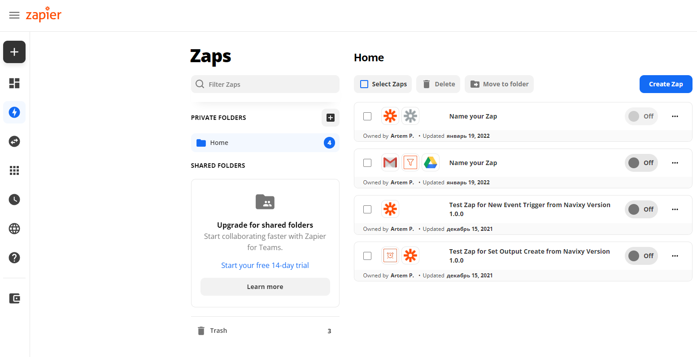
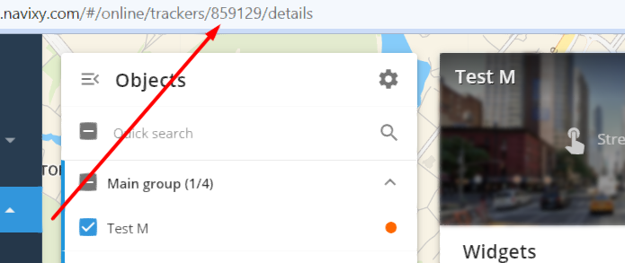
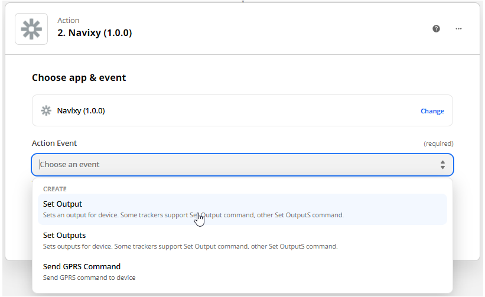
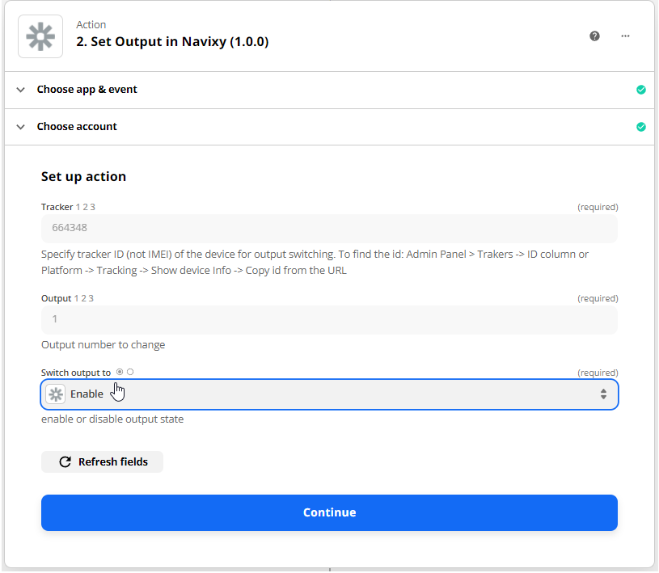

# Zapier Integration

Automate repetitive tasks and enhance productivity by integrating Navixy with Zapier. Zapier is a powerful automation tool that connects different applications, enabling you to streamline workflows without any coding. By using triggers and actions, Zapier allows you to automate processes, reducing manual effort and increasing efficiency.

## What is Zapier?

[Zapier](https://zapier.com) is a web-based service that automates actions between different apps. It follows a simple "When this happens, do that" logic. When an event occurs in one app (trigger), Zapier can make another app perform a specified action. This allows you to create seamless automated workflows, known as Zaps, to handle routine tasks.

## Benefits of using Zapier with Navixy

By integrating Navixy with Zapier, you can:

* Automate responses to events from your tracking devices
* Streamline communication and data flow between Navixy and other platforms
* Save time and reduce the potential for errors in manual tasks
* Enhance your operational efficiency and responsiveness

Example use cases include:

* Sending a GPRS command or activating an output on a schedule
* Sending a Slack message when a tracker event occurs
* Deactivating a tracker based on specific events

## Creating your first Zap

1. **Sign Up for Zapier**\
   First, ensure you have [signed up for a Zapier account](https://zapier.com/sign-up/).
2. **Conceptualize Your Zap**\
   Think about what you want to automate. For instance, you might want to deactivate equipment automatically when it leaves a specific geofence.
3. **Access Navixy Triggers and Actions**\
   Open the [invitation link](https://zapier.com/developer/public-invite/150604/58a1e9e9182a0403e11abe7314614505/) to access Navixy triggers and actions. Click "Accept invite & Build a Zap."
4. **Dashboard Overview**\
   The dashboard displays all your Zaps. You can create, update, and manage your Zaps here.

### Setting Up a Trigger

1. **Select App**\
   Search for and select the Navixy app.
2.  **Configure Trigger**\
    Choose "New Tracker Event" as the trigger. Connect your account by providing a User Session Key or an API key.

    Obtain a User Session Key from Navixy Admin Panel -> Users -> User -> Get session key. For API keys, refer to [authentication](../../user-api/backend-api/getting-started/authentication.md).

    Select the correct server (US for accounts starting with 1000xxxx, otherwise EU).
3. **Specify Trigger Details**
   * **Tracker IDs:** Find them in the admin panel or user interface.
   * **Event Types:** Specify one or multiple event types separated by comma from the provided list by click on the parameter name in Zapier or using [history/type/list](../../user-api/backend-api/resources/commons/history/history_type.md#list) API request.
   * **Account's Time Zone:** Specify the time zone (e.g., UTC+3 as 3).
   * **Time Interval:** Set the interval for event checks in minutes (e.g., 15 minutes).

### Setting Up an Action

Choose one of the following actions based on your device and use case.

1.  **Set Output**\
    For devices that change one output at a time.\
    Provide:

    * Tracker ID
    * Output number
    * Output state (enable/disable)

    
2.  **Set Outputs**

    For devices that change multiple outputs with one command.\
    Provide:

    * Tracker ID
    * Output states (e.g., true,true,false for outputs 1, 2, and 3)

    
3.  **Send GPRS Command**

    For sending specific commands to a device, such as switching a digital output.

    Provide:

    * Tracker ID
    * Command (protocol-related command for the device)

    

### Results

Activate your Zap to start the automation. Ensure your device is online to receive commands.

> Switching off the engine of a moving vehicle can lead to serious accidents and is extremely dangerous. This action should only be performed under safe conditions, such as when the vehicle is stationary and secured. Navixy is not liable for any accidents, injuries, or damages resulting from the improper use of this functionality.

For detailed steps and more examples, refer to the [Navixy documentation](../../).
