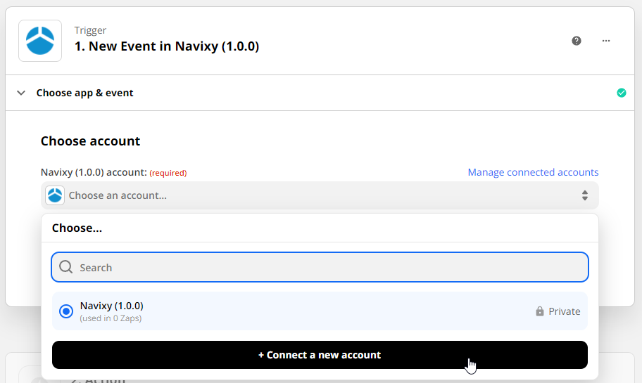
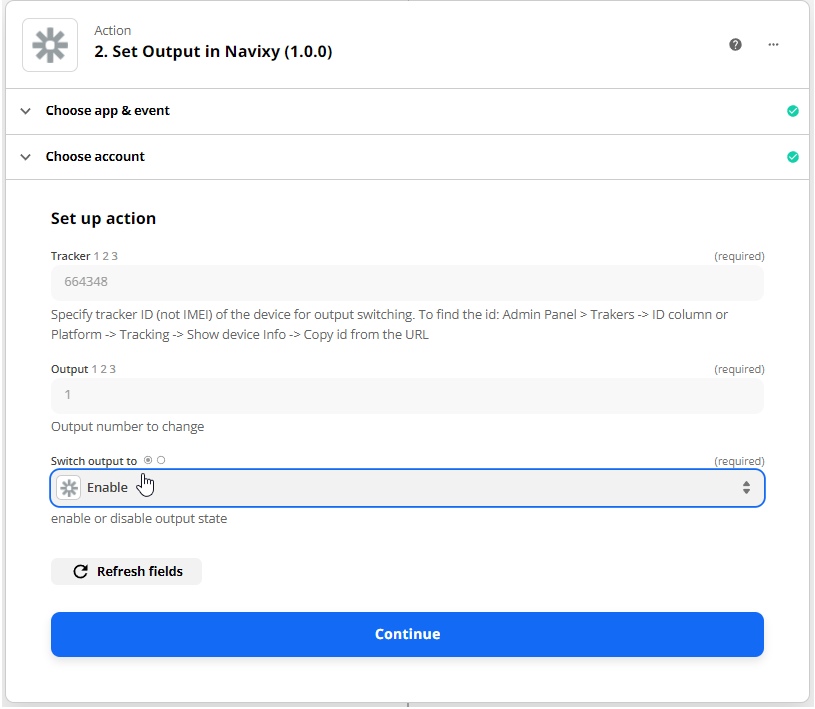
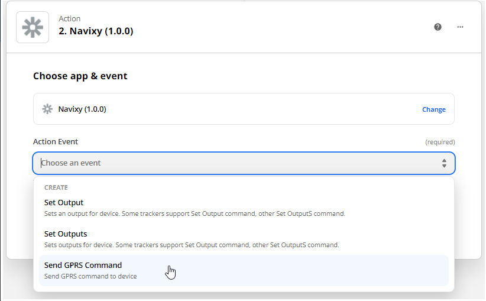

# Zapier

Automation is simply setting something up to run automatically. Automation is all around you, even if you don't realize it.
Take your smartphone, for example. You receive alerts whenever you receive a text message, voice mail, or email.

The heart of any automation boils down to a simple command: WHEN and DO. "When this happens, do that." Even the most complex 
automation can be broken down into this simple command.

Zapier is a tool that helps you automate repetitive tasks between two or more apps—no code necessary. When an event happens
in one app, Zapier can tell another app to perform (or do) a particular action.

A Zap is an automated workflow that tells your apps to follow this simple command: "When this happens, do that." Every
Zap has a trigger and one or more actions. A trigger is an event that starts a Zap, and action is what your Zap does for you.
When a Zap runs, each action it completes counts as one task.

Zapier is not for free but offers a free trial. Check their [pricing](https://zapier.com/app/billing/plans) before you start.

Example use cases you can achieve:

1. Send a GPRS command / activate output on schedule.
2. Send a Slack message on a tracker event.
3. Deactivate tracker on an event.

***

## Create your first Zap

First, make sure you have [signed up for a Zapier account](https://zapier.com/sign-up/).

Before you create a Zap, it's helpful to think about what you're trying to accomplish. For example, let's say you have 
shared equipment that shouldn't work outside a particular geofence. Every time you receive a notification about the 
geofence leaving you can open an account and switch output responsible for its work. But it is much more appreciated being
done automatically, isn't it?

You can [create a rule in the UI](https://www.navixy.com/docs/user/web-interface-docs/rules-docs/create-rule/) or make a 
new one [with APIs](../../backend-api/how-to/use-rules.md).

Open the [invitation link](https://zapier.com/developer/public-invite/150604/ce501cb480b559ee2b402283f0c8faa9/)
to get access to the Navixy triggers and actions. Without this link actions will be not in search results. Click on the
"Accept invite & Build a Zap" button to proceed.

Here you will see a dashboard with all your Zaps. You can create, update, switch on/off your Zaps.

Let's create a Zap. In a new window we should choose our app. Specify Navixy into search line and choose it from results.

After it, you will see the Zap's body that contains triggers and actions. Start with a trigger and choose your first in 
a dropdown. We need to get all new geofence exit events for all user's trackers on the platform and search for new of them
constantly. So let's choose a New Tracker Event.

The program will request you connect an account. 

Insert a User Session Key. Go to Navixy Admin Panel -> Users -> User -> click Get session key in the right menu. Read 
about limitations of [User Session Keys](https://developers.navixy.com/backend-api/resources/commons/api-keys/).
Also, you can [create an API key](../../backend-api/how-to/get-api-key.md)
for one user and make as many Zaps as you want with it. At the same time API keys will not expire.

There you should choose the correct server where your account is located. If your user account ID starts with 
1000xxxx - it is the US. Otherwise, choose the EU server.

***

### Set trigger

The next step is to configure a trigger. To create a simple Zap we recommend you use the New Tracker Event.

???+ example "Specify tracker IDs"

    You can find it in the admin panel. Admin Panel > Trakers -> ID column

    

    Or in the user inteface. Platform -> Tracking -> Show device Info -> Copy id from the URL

    

???+ example "Set event types"

    You can choose one type or several. Below is the list of all types:

    * inzone
    * outzone
    * offline
    * online
    * sos
    * battery_off
    * lowpower
    * poweroff
    * poweron
    * sensor_inrange
    * sensor_outrange
    * input_change
    * output_change
    * task_completed
    * task_delayed
    * task_failed
    * task_arrived
    * task_in_progress
    * checkpoint_completed
    * checkpoint_delayed
    * checkpoint_failed
    * checkpoint_arrived
    * checkpoint_in_progress
    * route_completed
    * route_faulty
    * route_failed
    * task_form_submitted
    * gps_lost
    * gps_recover
    * idle_start
    * idle_end
    * service_task_soon
    * service_task_expired
    * detach
    * attach
    * bracelet_close
    * bracelet_open
    * obd_plug_in
    * obd_unplug
    * strap_bolt_cut
    * strap_bolt_ins
    * light_sensor_bright
    * light_sensor_dark
    * vibration_start
    * vibration_end
    * lock_opened
    * lock_closed
    * case_opened
    * case_closed
    * g_sensor
    * force_location_request
    * alarmcontrol
    * crash_alarm
    * door_alarm
    * hood_alarm
    * ignition
    * parking
    * security_control
    * gsm_damp
    * info
    * odometer_set
    * tracker_rename
    * harsh_driving
    * auto_geofence_in
    * auto_geofence_out
    * inroute
    * outroute
    * speedup
    * track_end
    * track_start
    * work_status_change
    * call_button_pressed
    * driver_changed
    * driver_identified
    * driver_not_identified
    * driver_absence
    * driver_enter
    * driver_distraction_started
    * driver_distraction_finished
    * external_device_connected
    * external_device_disconnected
    * fueling
    * drain
    * forward_collision_warning
    * headway_warning
    * lane_departure
    * peds_in_danger_zone
    * tsr_warning
    * peds_collision_warning
    * checkin_creation
    * tacho
    * antenna_disconnect
    * check_engine_light
    * location_response
    * backup_battery_low
    * fatigue_driving
    * fatigue_driving_finished
    * proximity_violation_start
    * proximity_violation_end
    * no_movement
    * gps_damp
    * cruise_control_on
    * cruise_control_off
    * over_speed_reported
    * distance_breached
    * distance_restored
    * excessive_driving_start
    * excessive_driving_end
    * excessive_parking
    * excessive_parking_finished

???+ example "Specify account's timezone"

    Account time zones should be specified like the next example:

    * timezone is UTC+3 then specify 3;
    * timezone is UTC-3 then specify -3.

???+ example "Set a time interval for searching"

    Here the platform expects to get query intervals in minutes. Your Zap will look for events inside them.

    For example, 15 means - check events for the last 15 minutes before this Zap requested info. It should be the same as the frequency of your Zap requests.

***

### Set action

Now it is time to create an action. When conditions are specified Zapier wants to know - what action should be used.

There are two output actions and one for sending the GPRS command.

!!! note "Special control for some models"
    
    There are different safety output change scenarios on some models that prevent output switching when there is a fast speed. For example, SECO on  Teltonika devices. Other devices have specific commands that can switch output even on speed. You can contact the manufacturer to get the correct configurations, or you can use another action: "Send GPRS command" (if it is a device with a special command for output switch on speed).

We will describe here all actions to show how you can configure them. Choose only one that is convenient for your device
and use case.

???+ example "Set output"

    Is an action for devices that can change one output at a time. For example, enable immobilizer on the first output.

    

    Here we should choose an account again. It is already in the dropdown. The next what we should do is to set up action settings.

    

    Zapier asks for the next information to proceed:

    * Tracker ID - described in triggers;
    * Output - output number to change;
    * Switch output to - enable or disable output state.

???+ example "Set outputs"

    Is an action for devices that can change outputs with one general command. If we need to change one particular output state on such devices we should specify a new state for one and previous states for others.

    

    Here we should choose an account again. It is already in the dropdown. The next what we should do is to set up action settings.

    

    Zapier asks for the next information from us:

    * Tracker ID - described in triggers;
    * Output states - desired states of all digital outputs, e.g. true,true,false means output 1 is on, output 2 is on, output 3 is off.

???+ example "Send GPRS command"

    Is an action to send any command to a device. In our example, we use the command to switch digital output 1 on the Teltonika FMB920 device.

    

    Here we should choose an account again. It is already in the dropdown. The next what we should do is to set up action settings.

    

    Zapier requests to specify the next info:

    * Tracker ID - described in triggers;
    * Command -  a model's protocol-related command to send over GPRS.

### Results

The Zap is ready to work. Turn it on to start and try to out of the zone with your equipment. It will not work outside. 
Your device should be online to receive a command.

!!! warning "Output switching"

    Switching off the engine on a moving vehicle is dangerous. Navixy carries no responsibility for such action.