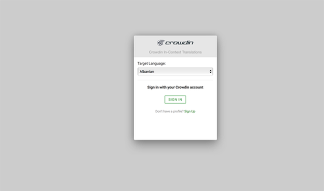
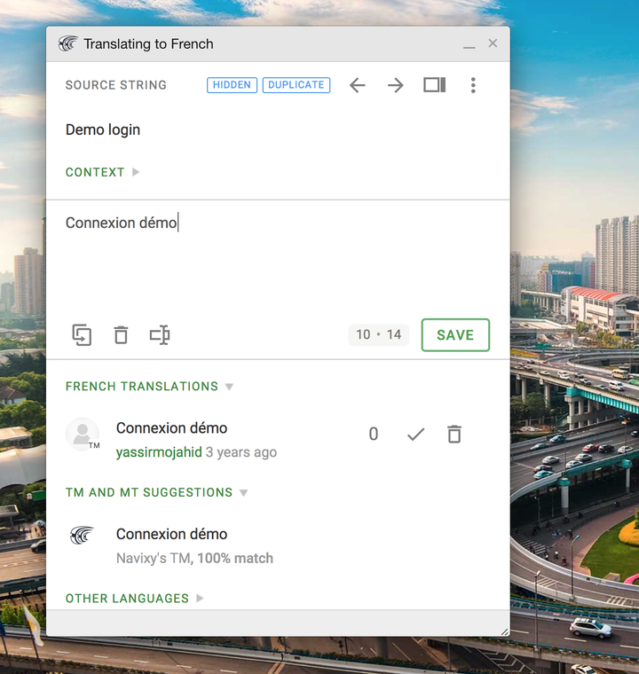
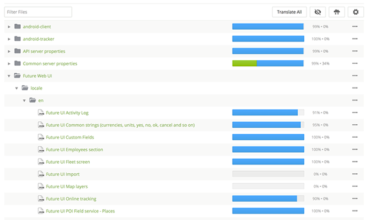
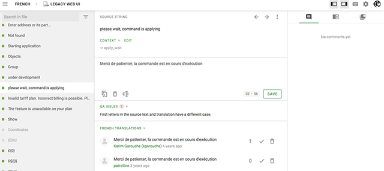

# Translate Navixy

Localizing Navixy products to the language of your choice is simple and handy. 
Add a new language or update an existing translation in a few easy steps. Then you can
translate Navixy to your language.

All translations are done through the [crowdin](http://crowdin.com) online translation service, developed 
specifically for team-based translation projects.

## Getting started

First of all you should contact your manager, to obtain Crowdin account associated with Navixy Crowdin project.

There are two ways to localize navixy platform:

* Crowdin In-context translation
* Translate via Crowdin UI

## Crowdin In-context translation (only Web UI)

Crowdin In-context translation is the most handy way to translate Navixy Web UI.

To launch Crowdin In-context service you should use special link:

```
https://demo.navixy.com/?locale=ach#/login
```

You should see crowdin authorization dialog.



After authorization standard Navixy UI will appear in a special translation mode. Click on a little icon near each text
item


opens translation dialog



## Translate via Crowdin UI

Crowdin UI is a most powerfull way to work with translations in Navixy, and the only way if you want to translate not
Backend and Mobile apps.



Translations in crowdin organized into several directories:

1. Common Server properties, API server properties, Tracking server properties, SMS server properties - translation strings for backend (Mainly for Reports, SMS and Email notifications)
2. Future Web UI, Legacy Web UI - translation strings for Navixy Web UI.
3. android-client, android-tracker, navixy-tracker-ios, navixy-viewer-ios - translation strings for mobile apps.

Each entry in each directory contains strings for translation, displayed in translation screen



If you have some problems with translation feel free to ask questions in comments.

## Translations delivery

Usually it takes about a week to deploy translations to production environment.

In case of standalone installations and mobile apps this time is linked to standalone/mobile app release schedule.

If you translate Navixy to the new language, after translation you should notify your manager that your translation is complete. Your manager will ask development team to add new language to the platform. In the other case translations of the existing language will be delivered to production automatically.
