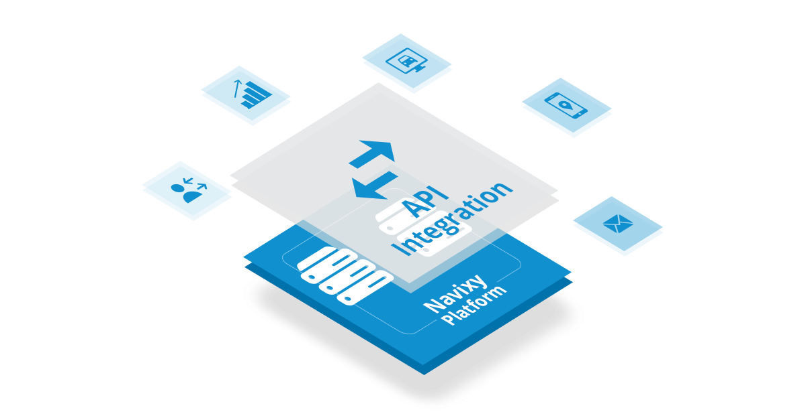

<!-- drop the spaces between { { and } } -->
<!-- Get involved: [github]({ { config.repo_url } }) -->
<!-- { { macros_info() } } -->

# Welcome to Navixy Developer Documentation

[Navixy][1] is a GPS tracking platform developed by [SquareGPS][2] company. 
Here you can find information about integration of 3rd party solutions with the Navixy platform,
API and technical documentation for developers and partners.

  [1]: https://www.navixy.com/
  [2]: https://squaregps.com/

All calls and methods will allow you to develop an application that pulls all the necessary information from the platform.
By combining and processing the information you receive you will be able to cover the needs of your customers and partners 
by providing them with a customized app. More personalized solution can attract more customers and increase their loyalty.
