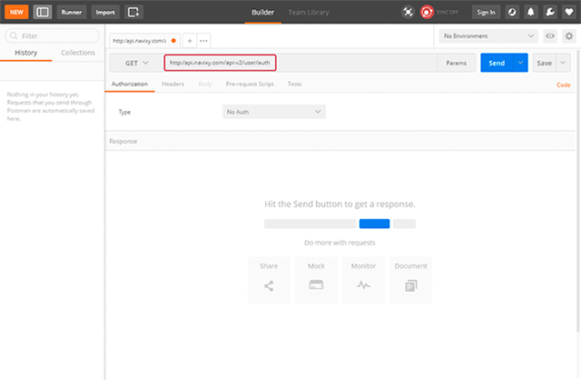
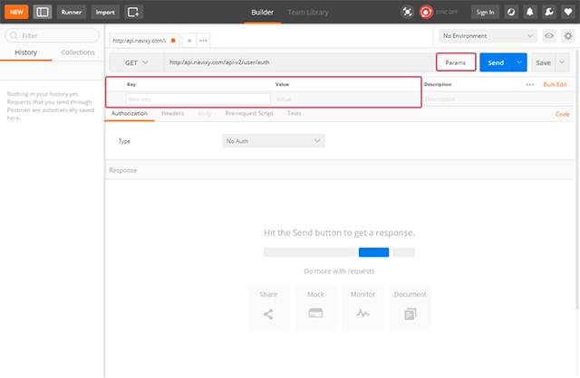
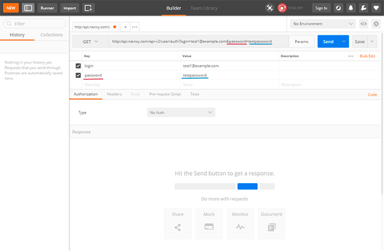

# Using Postman with Navixy

When working with API requests, developers have a wide range of tools at their disposal, from simple browser inputs to advanced software solutions. One of the preferred tools among developers is Postman, a robust platform for API development. Postman excels in various tasks, including simple request testing, API creation, and ongoing maintenance.

Navixy streamlines API integration by offering ready-made Postman collections. These collections allow developers to quickly import, test, and modify API requests without manual setup, enhancing efficiency and simplifying the process of interacting with Navixy's platform.

**Navixy Postman Collections URL:**

```
https://www.postman.com/navixy/
```

**Navixy API Sandbox in Postman URL:**
```
https://www.postman.com/navixyapisandbox/workspace/navixy-api-sandbox/overview
```

For this guide, we will focus on using Postman as an API client.

## Getting Started with Postman

### What is Postman?

Postman is a collaboration platform for API development, used by over 10 million developers worldwide. It simplifies the process of building, testing, and maintaining APIs, offering a user-friendly interface for sending requests and receiving responses.

### Installing Postman

To get the latest version of the [Postman app](https://postman.com), visit the download page and click “Download” for your platform. Follow the installation instructions specific to your operating system.

### Setting Up Postman

1. **Open Postman:** After installation, open the Postman application.
2. **Create an Account:** Sign up for a Postman account if you don't already have one. This will allow you to save your work and sync it across devices.
3. **Import Navixy Collections:** Use the link provided above to import the Navixy Postman collections into your workspace.

## Your First Request

The Postman API client simplifies sending API requests and ensures that parameters are correctly formatted. This is particularly useful for handling complex or large requests.

### Steps to Make Your First Request

1. **Select a Request Method:**

    

    Each API request uses an HTTP method. The most common methods for the Navixy API are GET and POST. GET retrieves data from the API, while POST sends new data.

2. **Enter the Base Request URL with the Resource and Sub-resource:**

    In our example, we will use [`user/auth`](../user-api/backend-api/resources/commons/user/index.md#auth) and [`tracker/list`](../user-api/backend-api/resources/tracking/tracker/index.md#list) requests. Base request URLs are:

    * For EU server - `https://api.eu.navixy.com/v2/`
    * For US server - `https://api.us.navixy.com/v2/`

    

3. **Click on the Params Button:**

    

    Fill in the fields - Key (parameter name from documentation) and value. For the `user/auth` request, we have 2 keys that should be transmitted - login and password.

    Once you fill out the parameter name, it is automatically added to the request line.

    

    Similarly, with values and additional parameters: 

    
    
    

4. **Press Send:**

    You will see the reply, already split and highlighted for easier reading:

    

    In this case, we have received a hash that should be copied and used for future requests.

    Example: [`tracker/list request`](../user-api/backend-api/resources/tracking/tracker/index.md#list)

    

### Managing Parameters

If your request has multiple parameters listed, you can easily enable and disable them to prevent errors:


### Request History

Postman keeps a history of your requests on the left side of the application. You can revisit and re-execute previous requests with a simple double-click, opening them in a new tab:


## Examples in Documentation

The Navixy API documentation includes both the structure of requests and examples. You can copy these examples into Postman, where parameters will be automatically parsed for convenient editing:


### Importing cURL Examples into Postman

You can also import cURL examples from our documentation into Postman. Copy the cURL example, open the import tab in Postman, choose Raw Text, paste the example, and save it:


## See Also

- [How to work with Navixy API Sandbox on Postman](https://www.postman.com/navixyapisandbox/workspace/navixy-api-sandbox/folder/8534541-b576926c-002f-42aa-8a4c-b67ee63096f9?action=share&source=copy-link&creator=8534541&ctx=documentation)
- [Streamline development with Navixy API and Postman](https://www.navixy.com/blog/streamline-development-with-navixy-api-and-postman/?from=docs_dev)
- [Developer-Friendly Telematics API: Navixy API Sandbox in Postman](https://www.navixy.com/blog/optimising-api-integration-navixy-api-sandbox-in-postman/?from=docs_dev)