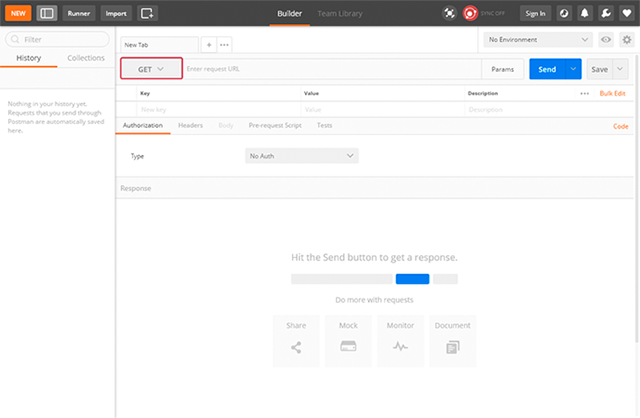
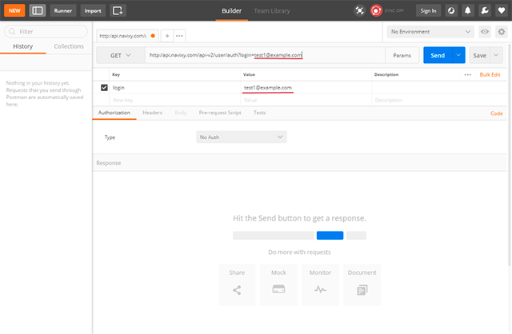
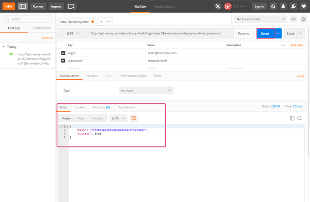
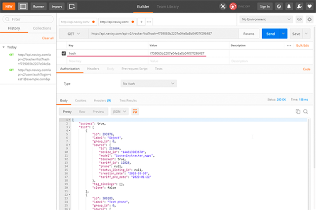
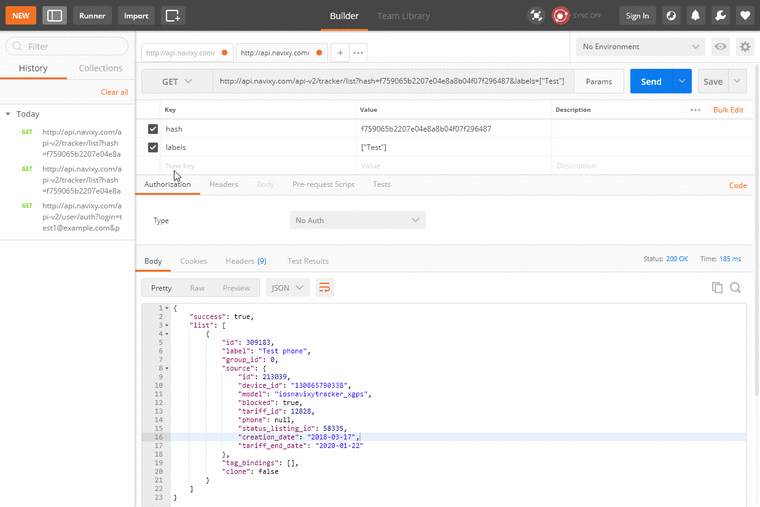
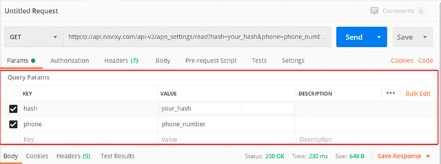

# Postman
 
There are many tools that could be used to work with API requests. 
From simple input to browser’s address line or cmd tool to more complex software. 
One of our personal favorites is Postman application. 
[Postman](https://www.postman.com/) is a collaboration platform for API development. 
It can be used for a variety of purposes ranging from simple request 
testing to creating and maintaining your own APIs for your own software. 

For our purposes we will only review their API client.

## Your first request

Postman API client allows you to easily send various API requests and helps you
fill out parameters without worrying that you will miss a quote or bracket. 
This can be especially handy when working with large requests. 

1. Select a request method:

    

    Each API request uses an HTTP method. The most common methods for Navixy API are GET and POST. 
    GET methods retrieve data from an API. POST sends new data to an API.

1. Enter base request URL with the resource and sub-resource. In our example we will
   use user/auth and  tracker/list requests. Base request URLs are:

    *	For EU server - `https://api.navixy.com/v2/fsm/user/auth`
    *	For US server - `https://api.us.navixy.com/api-v2/fsm/tracker/list`

    

1. Click on the Params button, and you will see a table for key and value input: 

    

    We will only ever need to fill 2 fields - Key (parameter name from documentation) and value.
    For user/auth request, we have 2 keys that should be transmitted - login and password.

    You can see that once we fill out the parameter name - it is automatically added to the request line.

    

    Similarly, with values and additional parameters: 

    
    
    

1. Press send, and you will see the reply, already split and highlighted for easier reading 

    

    In this case, we have received a hash that should be copied and user for future requests. 

    Example: [tracker/list request](../backend-api/resources/tracking/tracker/tracker.md#list)

    
    

### Working with parameters

If your request has multiple parameters listed - you can easily enable and disable, preventing errors: 

### History of requests

On the left side of postman application a history of your requests is stored. 
If you made errors or oo many changes and just want to go back to the old version 
or re-execute the request made in the past - a simple double-click will open a request in a new tab:

## Examples in documentation

You could see that our API documentation has both structure of the request and examples. You can copy them and paste in postman. In this case all parameters will be automatically separated to strings for more convenient editing

## How to install

To get the latest version of the [Postman app](https://postman.com), visit the download page and click "Download" for your platform.

