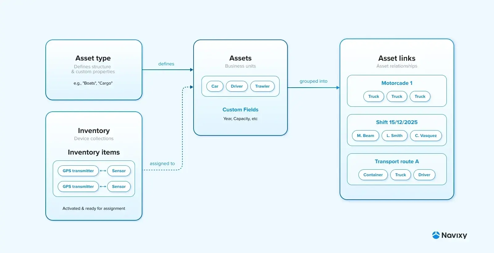

# Overview

### Introduction

**Navixy Repository API** is a programming interface that enables you to create fully customized trackable assets with any properties you need, assign GPS devices to make them location-aware, and establish relationships between assets to model your exact business operations. Whether you're tracking delivery drivers, managing construction equipment with maintenance schedules, or monitoring livestock with health data, this API lets you define custom asset types, assign multiple tracking devices, and link assets together.

For example, a logistics company can define an asset type called "Refrigerated Container," add properties like "Temperature Range," "Cargo Type," and "Customer," assign GPS trackers and sensors, and link containers to "Transport Route A," which includes associated trucks and drivers.

For CTOs and system architects, it represents a stable API-first data model, while system integrators and product teams can use it to cherry-pick asset and device data and embed it into their own solutions.

### Purpose and capabilities

**Navixy Repository API** serves as a comprehensive asset management system that allows you to perform the following operations:

* Create and update **business assets** (vehicles, staff, livestock, equipment, etc.)
* Create and configure **asset types** with user-defined properties ("Boats," "Bikes," "Tractors" with custom fields such as "Year of manufacture" or "Water tank capacity")
* Manage **inventories** — user-defined logical device groups (devices assigned to warehouses)
* Create and manage **asset links** (driver + car, work crews, etc.)
* Activate and assign devices (activate a GPS tracker in the system and assign it to a car)

### Key concepts

<figure><figcaption></figcaption></figure>

**Navixy Repository API** operates using the following resources:

<table><thead><tr><th width="138.5999755859375">Term</th><th>Definition</th></tr></thead><tbody><tr><td><a href="broken-reference"><strong>Asset</strong></a></td><td>An object that represents a real-world business unit: a person, car, boat, bike, piece of equipment, or any other trackable resource.</td></tr><tr><td><a href="broken-reference"><strong>Asset type</strong></a></td><td>Defines the structure of custom property fields and display configuration for assets. Examples: "Boats", "Cargo", "Warehouse Operators". Supports full customization: field groups, fields order, field properties (label, description, required or not).</td></tr><tr><td><a href="broken-reference"><strong>Asset link</strong></a></td><td>Assets grouped in line with the user's business logic, such as "Staff" → "Shift 15/12/2025" or "Truck, 3 trailers, driver 1, driver 2" → "Motorcade 1." This allows for flexible connections while maintaining relationship history between assets.</td></tr><tr><td><a href="broken-reference"><strong>Inventory</strong> </a><strong>and</strong> <a href="broken-reference"><strong>inventory item</strong></a></td><td>
Devices (GPS trackers, sensors, etc.) are kept in <strong>inventories</strong> — collections used to efficiently organize and manage equipment. They help structure, track, and operate devices. 

Devices stored in inventories, called <strong>inventory items</strong>, can be activated, paired, and assigned to assets. Note that multiple devices can be connected to a single asset.
</td></tr></tbody></table>

### Navigation

The **Navixy Repository API documentation** is organized into two complementary sections designed to help you understand concepts and implement solutions.

#### Section content

These articles provide essential background knowledge and guidelines:

* [**Getting started**](getting-started.md): A step-by-step tutorial that walks you through your first API integration, from authentication to creating your first group of linked assets.
* [**Authentication**](authentication.md): A comprehensive guide to using OAuth 2.0 authorization protocol.
* [**Technical reference**](technical-reference.md): Implementation details covering server URLs, API versioning, pagination strategies, sorting mechanisms, and advanced filtering options.
* [**Guides**](guides/): In-depth guides exploring the most common use cases.

#### Endpoint reference

The endpoint reference is organized by resource type, such as `/asset`, `/asset_type`, `/inventory`), and provides complete technical specifications for each endpoint.

**For each API call, you'll find:**

* **HTTP method** (`GET` or `POST`) and endpoint URL
* **Endpoint description** explaining the operation's purpose (e.g., "Returns all assets available to the organization")
* **Parameter documentation**: Complete schemas for query parameters and request bodies, with detailed descriptions for each field
* **Response schemas** organized by HTTP status code, showing exactly what data you'll receive
* **Code examples**: Sample requests and responses in multiple formats
