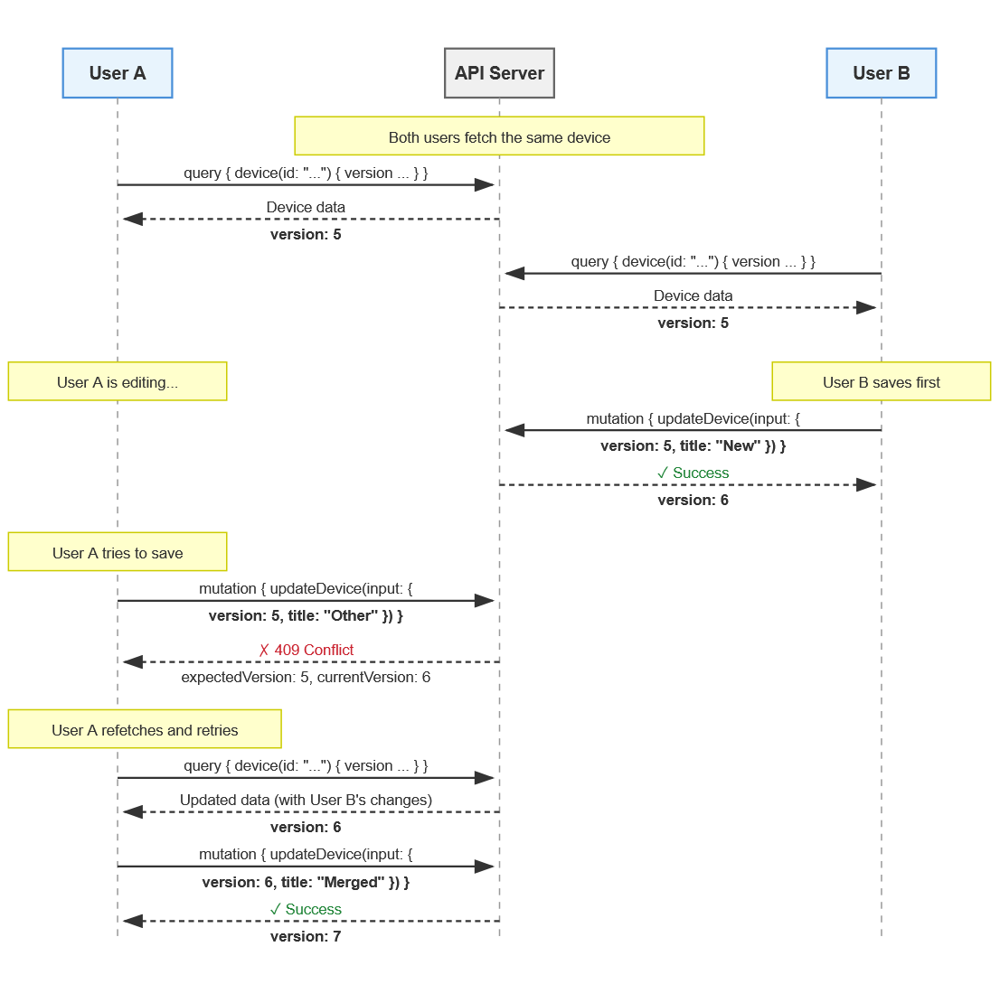

# Optimistic locking

Navixy Repository API uses a `version` field for optimistic concurrency control, preventing lost updates when multiple clients simultaneously edit the same entity.

### How optimistic locking works

Every versioned entity includes a `version` field:

```graphql
type Device {
  id: ID!
  version: Int!
  name: String!
  # ...
}
```

The version starts at 1 when an entity is created and increments with each successful update.

Update and delete mutations require the current version:

```graphql
input UpdateDeviceInput {
  id: UUID!
  version: Int!   # Required
  title: String
  # ...
}

input DeleteDeviceInput {
  id: UUID!
  version: Int!   # Required
}
```

### Supported entities

Optimistic locking applies to:

<table><thead><tr><th width="180">Entity</th><th>Description</th></tr></thead><tbody><tr><td><a href="api-reference/objects.md#device">Device</a></td><td>GPS trackers, sensors, beacons</td></tr><tr><td><a href="api-reference/objects.md#asset">Asset</a></td><td>Vehicles, equipment, employees</td></tr><tr><td><a href="api-reference/objects.md#assetgroup">AssetGroup</a></td><td>Asset collections</td></tr><tr><td><a href="api-reference/objects.md#geoobject">GeoObject</a></td><td>Geofences, POIs, routes</td></tr><tr><td><a href="api-reference/objects.md#schedule">Schedule</a></td><td>Work hours, maintenance windows</td></tr><tr><td><a href="api-reference/objects.md#inventory-1">Inventory</a></td><td>Warehouse records</td></tr><tr><td><a href="api-reference/objects.md#organization">Organization</a></td><td>Organization hierarchy nodes</td></tr><tr><td><a href="api-reference/objects.md#user">User</a></td><td>User accounts</td></tr><tr><td><a href="api-reference/objects.md#member">Member</a></td><td>Organization memberships</td></tr><tr><td><a href="api-reference/objects.md#integration">Integration</a></td><td>External system integrations</td></tr><tr><td><a href="api-reference/objects.md#customfielddefinition">CustomFieldDefinition</a></td><td>Custom field metadata</td></tr><tr><td><a href="api-reference/interfaces.md#catalogitem">CatalogItem</a></td><td>All catalog items (device types, asset types, roles, tags, etc.)</td></tr></tbody></table>

### Operations by type

<table><thead><tr><th width="116">Operation</th><th width="213.60003662109375">Version in input</th><th>Behavior</th></tr></thead><tbody><tr><td>Create</td><td>Not required</td><td>Returns version: 1</td></tr><tr><td>Update</td><td>Required</td><td>Returns CONFLICT error on mismatch</td></tr><tr><td>Delete</td><td>Required</td><td>Returns CONFLICT error on mismatch</td></tr></tbody></table>

### Workflow

Here's the typical flow for updating an entity:

1. Query returns version:

```graphql
query {
  device(id: "550e8400-e29b-41d4-a716-446655440001") {
    id
    version    # Returns 5
    title
  }
}
```

2. Mutation requires version in input:

```graphql
mutation {
  updateDevice(input: {
    id: "550e8400-e29b-41d4-a716-446655440001"
    version: 5          # Must match the current version
    title: "New name"
  }) {
    device {
      id
      version          # Returns 6 (incremented)
      title
    }
  }
}
```

### Handling conflicts

If the entity was modified since you fetched it, the API returns a CONFLICT error. The HTTP status code will be 200 because the request was successfully received and processed — the "conflict" is a business logic outcome, not a transport failure. This follows the [GraphQL-over-HTTP specification](https://graphql.github.io/graphql-over-http/draft/), which reserves HTTP error codes (4xx, 5xx) for transport-level problems like authentication failures or malformed requests.

The actual error details are in the response body:

```json
{
  "errors": [{
    "message": "Conflict: entity was modified by another request",
    "path": ["deviceUpdate"],
    "extensions": {
      "type": "https://api.navixy.com/errors/conflict",
      "title": "Optimistic Lock Conflict",
      "status": 409,
      "detail": "Device was modified. Expected version 5, current version 6",
      "code": "CONFLICT",
      "entityType": "Device",
      "entityId": "550e8400-e29b-41d4-a716-446655440001",
      "expectedVersion": 5,
      "currentVersion": 6,
      "traceId": "2cf7651916cd43dd8448eb211c80319e"
    }
  }],
  "data": null
}
```

Use `extensions.code` for programmatic error handling, not HTTP status codes. See [Error handling ](error-handling.md)for more details.

When you receive a conflict error:

1. Fetch the entity again to see what changed
2. Merge the other user's changes with yours if needed
3. Retry your update with the new version

### Concurrent editing example

Here's what happens when two users edit the same device:

<figure><figcaption></figcaption></figure>

User A's update succeeds first. User B's update fails because the version changed. After refetching, User B can successfully update with the current version.

### Idempotent commands

Mutations that manage relationships and assignments are called **idempotent commands**. They do not require or check the `version` field.

| Mutation                                                                    | Purpose                       |
| --------------------------------------------------------------------------- | ----------------------------- |
| [deviceInventoryLink](api-reference/mutations.md#deviceinventorylink)       | Link device to inventory      |
| [deviceInventoryUnlink](api-reference/mutations.md#deviceinventoryunlink)   | Unlink device from inventory  |
| [deviceIdentifierAdd](api-reference/mutations.md#deviceidentifieradd)       | Add identifier to device      |
| [deviceIdentifierRemove](api-reference/mutations.md#deviceidentifierremove) | Remove identifier from device |
| [assetGroupItemAdd](api-reference/mutations.md#assetgroupitemadd)           | Add asset to group            |
| [assetGroupItemRemove](api-reference/mutations.md#assetgroupitemremove)     | Remove asset from group       |
| [roleAssign](api-reference/mutations.md#roleassign)                         | Assign role to actor          |
| [roleRevoke](api-reference/mutations.md#rolerevoke)                         | Revoke role from actor        |
| [permissionGrant](api-reference/mutations.md#permissiongrant)               | Grant permission to role      |
| [permissionRevoke](api-reference/mutations.md#permissionrevoke)             | Revoke permission from role   |
| [userScopeSet](api-reference/mutations.md#userscopeset)                     | Set user scope restriction    |
| [userScopeRemove](api-reference/mutations.md#userscoperemove)               | Remove user scope restriction |

These operations behave as follows:

* Calling `link`/`assign`/`grant`/`add` when the relationship already exists returns success without making changes
* Calling `unlink`/`revoke`/`remove` when the relationship doesn't exist returns success without making changes

This design simplifies client code. You can safely retry these operations without worrying about conflicts or checking the current state first.

### Best practices

1. **Always include the version in your queries.** When fetching entities you plan to modify, request the `version` field so you have it ready for mutations.
2. **Handle conflicts gracefully.** In collaborative applications, version conflicts are expected. Implement retry logic or prompt users to review changes.
3. **Don't cache versions long-term.** Versions can change at any time. Always use the version from your most recent fetch of the entity.
4. **Consider user experience.** When a conflict occurs, show users what changed and let them decide how to proceed rather than silently retrying.
